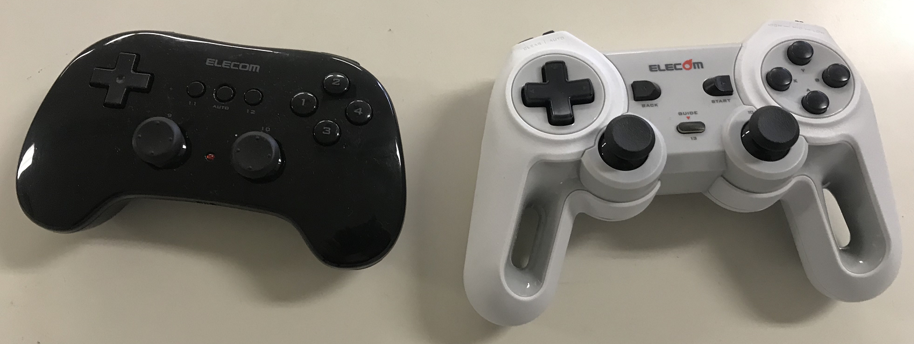
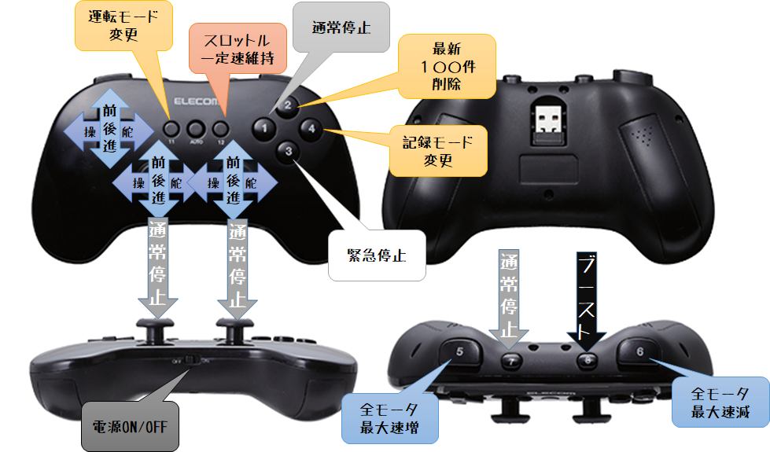
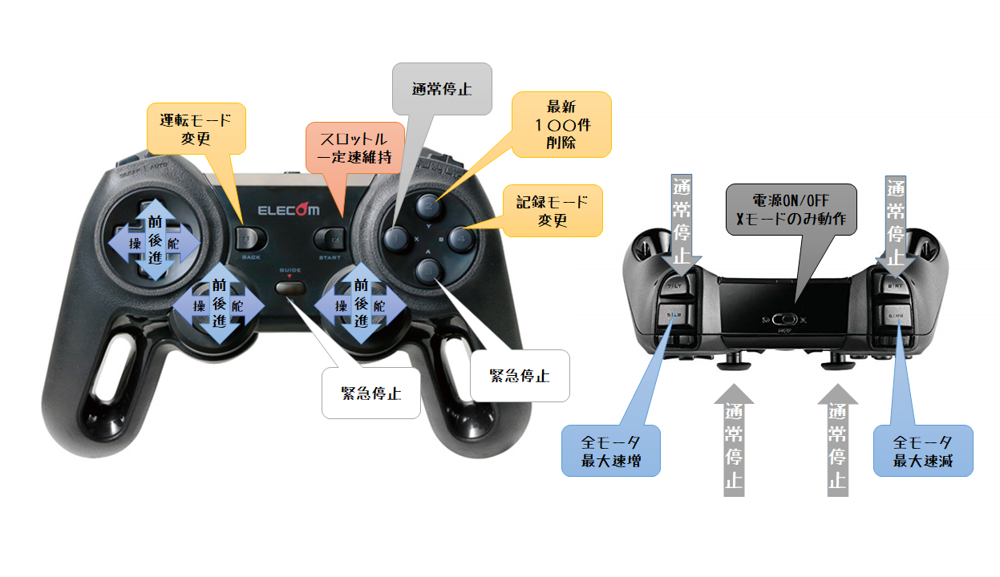

# ELECOM 製 JC-U3912T/JC-U4113S ワイヤレスゲームパッド用 Donkeycar パーツクラス



本リポジトリでは、ELECOM製 JC-U3912T / JC-U4113S ワイヤレスゲームパッドを Donkeycar のコントローラとして使用するためのパーツクラスを提供する。

* [yodobashi.comサイトリンク:ELECOM製JC-U3912T](https://www.yodobashi.com/product/100000001003397804/)
* [AMAZONサイトリンク:ELECOM製JC-U4113S](https://www.amazon.co.jp/%E3%82%A8%E3%83%AC%E3%82%B3%E3%83%A0-%E3%83%AF%E3%82%A4%E3%83%A4%E3%83%AC%E3%82%B9-%E3%82%B2%E3%83%BC%E3%83%A0%E3%83%91%E3%83%83%E3%83%89-Xinput-JC-U4113SBK/dp/B01MXY05W0/ref=sr_1_6?__mk_ja_JP=%E3%82%AB%E3%82%BF%E3%82%AB%E3%83%8A&keywords=Elecom+%E3%82%B2%E3%83%BC%E3%83%A0%E3%83%91%E3%83%83%E3%83%89&qid=1574656606&sr=8-6)

> * 日本国内の走行会ではLogicool F710 ゲームパッド利用者が多いが、多数の参加者がいる場合混戦する可能性があるため、比較的マイナーなゲームパッドを利用することで、多少は回避可能となる。
> * JC-U3912T は現在入手が難しいが、JC-U4113Sは通販サイトで用意に入手可能。

## 1 インストール

### 1.1 パッケージのインストール

#### 1.1.1 pip インストール

すでにmycarディレクトリなどでDonkeycarアプリケーションがインストール済みのRaspberry Pi にログインして、以下のコマンドを実行してください。

```bash
cd ~/projects
git clone https://github.com/coolerking/donkeypart_elecom_controller
cd donkeypart_elecom_controller
git checkout master
pip install -e .
```

#### 1.1.2 ソースコードの移動によるインストール

> デフォルトの操作割り当てを変更したい場合は、こちらを選択すること。

```bash
cd ~/projects
git clone https://github.com/coolerking/donkeypart_elecom_controller
cd donkeypart_elecom_controller
git checkout master
mv donkeypart_elecom_controller ~/mycar
```


### 1.2 `manage.py` の変更

147行目のfrom import 文を以下のように変更する。

変更前：

```python
    if use_joystick or cfg.USE_JOYSTICK_AS_DEFAULT:
        #modify max_throttle closer to 1.0 to have more power
        #modify steering_scale lower than 1.0 to have less responsive steering
        from donkeycar.parts.controller import get_js_controller

        ctr = get_js_controller(cfg)
```

変更後：

```python
    if use_joystick or cfg.USE_JOYSTICK_AS_DEFAULT:
        #modify max_throttle closer to 1.0 to have more power
        #modify steering_scale lower than 1.0 to have less responsive steering
        #from donkeycar.parts.controller import get_js_controller
        from donkeypart_elecom_controller import get_js_controller

        ctr = get_js_controller(cfg)
```

> ソースコード移動によるインストールの場合、pylint がワーニングを出す場合がある。そのような場合は以下のようにドットをつけて対応する。
> ```python
> from .donkeypart_elecom_controller import get_js_controller
> ```

### 1.3 `myconfig.py` の変更

Donkeycarアプリケーションがインストールされているディレクトリ(donkey createcar --path で指定したディレクトリ：以降 `~/mycar` として例示)に移動して、`myconfig.py` の `CONTROLLER_TYPE` を変更してください。

|**コントローラ名**|**CONTROLLER_TYPE値**|
|:-|:-|
｜JC-U3912T|`jcu3912t`|
|JC-U4113S|`jcu4113s`|

また、`myconfig.py`の以下の値も適宜変更してください。

|**キー名**|**デフォルト値**|**説明**|
|:-|:-|:-|
|`JOYSTICK_THROTTLE_DIR`|`-1`|スロットル方向を変更する。デフォルト値と正反対の高校にしたい場合は`1`を設定する。|
|`JOYSTICK_MAX_THROTTLE`|`0.5`|スロットルに割り当てた操作を最大限実行したときのデフォルト出力は50%(`0.5`)となっているので、変更したい場合は `0.0` から `1.0` までの値で増減させる。|
|`JOYSTICK_STEERING_SCALE`|`1.0`|スロットルを最大限まで操作したくない、操舵角を制限したい場合はこの値を `0.0` から `1.0` までの範囲で変更する。|
|`AUTO_RECORD_ON_THROTTLE`|`True`|スロットル入力されている間、自動的にTubデータを記録するかどうか。|
|`USE_JOYSTICK_AS_DEFAULT`|`False`|`manage.py`を実行する際に`--js`をつけなくても、ジョイスティック操作前提でdonkeycarアプリケーションが起動させたい場合`True`に変更する。|

### 1.4 USBアダプタの接続

ELECOM JC-U3912T/JC-U4113S に付属するUSBアダプタを Raspberry Piに接続する。

### 1.5 ゲームパッドの電源投入

ゲームパッドの電源を投入する。

JC-U3991Tの場合は、本体下面にスイッチをONにする。

JC-U4113Sの場合は、本体上面にスイッチがあるのでOFFからX側にスイッチを入れる。

> JC-U4113S の Direct Inputモード(D側のスイッチ)では動作しない。

### 1.6 Donkeycar アプリケーションの起動

他のゲームパッドと同じ様に、Donkeycarアプリケーションを起動する。

```bash
cd ~/mycar

# 手動運転起動例
python manage.py drive --js

# 自動運転起動例
python manage.py drive --js --type linear --model models/mypilot.h5
```

## 2 操作方法

### 2.1 JC-U3912T



### 2.2 JC-U4113S



### 2.3 割り当てを変更する場合

ソースコードを修正する必要があるため、`pip install -e` ではなく、donkeycarアプリケーションディレクトリへソースコード移動によるインストールが前提となる。

割り当てを変更するには`~/mycar/donkeypart_elecom_controller/parts/controller.py`のクラス `ELECOM_JCU3912TController` もしくはクラス `ELECOM_JCU4113SController` の関数 `init_trigger_maps()` 内に定義された3つのインスタンス変数を変更する。

|**インスタンス変数名**|**内容**|
|`self.button_down_trigger_map`|キーがボタン入力対象名、値がボタン押下時に呼び出される関数となっている辞書。|
|`self.button_up_trigger_map`|キーがボタン入力対象名、値がボタン離脱時呼び出される関数となっている辞書。|
|`self.axis_trigger_map`|キーがアナログ入力対象名、値がアナログデバイスに変化があったときに呼び出される関数となっている辞書。|

ここで「ボタン入力」とは、ボタンデバイス操作などにより `0`(離脱時)もしくは`1`(押下時)の値しか返却しない入力デバイスのことを指す。クラス `ELECOM_JCU3912TJoystick` もしくはクラス `ELECOM_JCU4113SJoystick` の関数 `__init__()` 内にて定義されているインスタンス変数 `self.button_names` にて定義されている。`0`もしくは`1`の値であるため、押下時の操作が定義されている `self.button_down_trigger_map` や離脱時の操作が定義されている `self.button_up_trigger_map` の値として定義する関数には引数を定義しない。

「アナログ入力」とは、アナログスティックを倒す操作などにより `0.0`(中央位置)から`1.0/-1.0`(押倒時)までの`float`値を返す入力デバイスのことを指す。クラス `ELECOM_JCU3912TJoystick` もしくはクラス `ELECOM_JCU4113SJoystick` の関数 `__init__()` 内にて定義されているインスタンス変数 `self.axis_names` にて定義されている。操作によりどのような値が入力されたか割り当てられた関数内で認識させる必要があるため、`float`値を1つ引数として定義された関数を定義しなくてはならない。引数で割り当てられた値は`-1.0`から`1.0`までの値となるが、ゲームパッドによって押し倒し方向により正負が反転する場合がある。`myconfig.py`の`JOYSTICK_THROTTLE_DIR`を変更しても修正できない場合は、独自関数を作成しマッピングを変更する必要がある。

> ゲームパッドによって、十字キーやトリガボタンが「ボタン入力」であったり、「アナログ入力」であったり異なる場合がある。たとえばJC-U3912Tの十字キーが「アナログ入力」扱い(入力値は`0`か`1`)であるのに対し、JC-U4113Sの十字キーは「ボタン入力」扱いとなっており、同じ製造元でもことなっている。

#### 2.3.1 割り当て可能なボタン入力操作関数

以下の関数はdonkeycarパッケージ上に定義されているもののみ記述している。

|**関数名**|**動作**|
|:-|:-|
|`self.erase_last_N_records()`|最新100件のTubデータを削除する。|
|`self.emergency_stop()`|緊急停止する。|
|`self.toggle_manual_recording()`|Tubデータの記録モードを変更する。`AUTO_RECORDING_ON_THROTTLE`が`True`の場合は操作しても変更されない。|
|`self.increase_max_throttle()`|最大速度値(初期値は`JOYSTICK_MAX_THROTTLE`)を`0.1`増やす。|
|`self.decrease_max_throttle()`|最大速度値(初期値は`JOYSTICK_MAX_THROTTLE`)を`0.1`減らす。|
|`self.toggle_constant_throttle()`|一定速走行を行う(デフォルト状態は行わない)。トグルスイッチとなっており、押下ごとに行う・行わないを繰り返す。|
|`self.toggle_mode()`|運転モードを変更する。初期状態は手動運転(`user`)。実行されるたびに操舵のみ自動運転(`local_angle`)、全部自動運転(`local`)、手動運転..とトグルされる。|
|`self.chaos_monkey_on_left()`|ステアリングをやや左(`-0.2`)に固定し、入力値を受け付けなくする。|
|`self.chaos_monkey_on_left()`|ステアリングをやや右(`-0.2`)に固定し、入力値を受け付けなくする。|
|`self.chaos_monkey_off()`|上記2関数によるステアリング固定を解除し、入力値を受け付ける。|

#### 2.3.1 割り当て可能なアナログ入力操作関数

以下の関数はdonkeycarパッケージ上に定義されているもののみ記述している。

|**関数名**|**動作**|
|:-|:-|
|`self.set_steering()`|引数で渡されたステアリング値を設定する。|
|`self.set_throttle()`|引数で渡されたスロットル値を設定する|

## A. ライセンス

* 本リポジトリのソースコードは [MITライセンス](./LICENSE) 準拠である。
* 本リポジトリのソースコードは、[donkeycar](https://github.com/autorope/donkeycar) パッケージのコマンド`donkey createjs`により生成したコードを改変して作成した。
